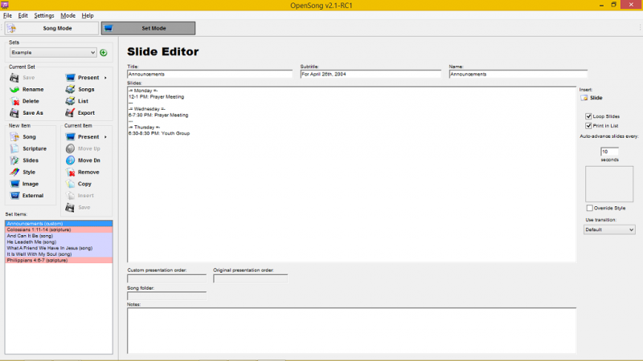
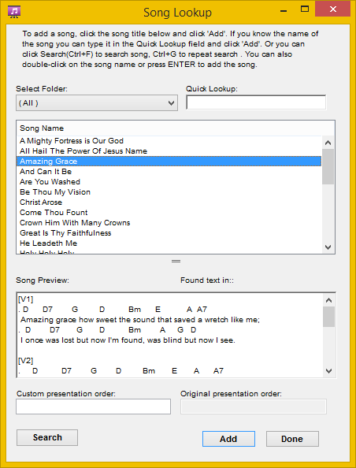
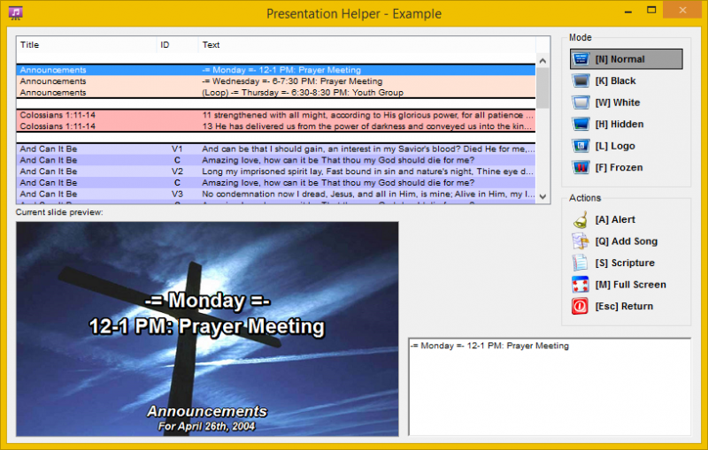

# Getting Started

## Songs

Although OpenSong already comes with a number of songs already installed, with additional song available from the [Download](../downloads.md) page, you will probably want to add songs that are not included.

By default OpenSong loads up the Song editing page.

1.  Under New song Click 'Create'.
2.  When Prompted, enter the song's Title (this will also be the songs file name) and click 'OK'.
3.  Enter the remaining information for the song including:

    - Author
    - CCLI number
    - Presentation order
    - Hymn number (to reference existing song books)
    - Copyright (You don't need to type 'Copyright ©' as OpenSong will add that as necessary)

4.  Enter the chords/lyrics to the song. When entering Chords/Lyrics you will need to remember some things:

    - All Lyric lines must begin with at least one space
    - All Chord lines must begin with a period '.'
    - To tell OpenSong you are starting a new section (Verse, Chorus, etc.) place the section title in square brackets '[' & ']'. OpenSong understands:

      - V: Verse
      - 1-9: Numbered verses
      - C: Chorus
      - B: Bridge
      - P: Pre-Chorus
      - T: Tag

    - When Presenting OpenSong automatically places each new section on a new slide. To force OpenSong to start text on a new slide part way through a section place a double bar '||' at the point you want the Slide break to happen.

5.  Under Selected Song click 'Save'.

6.  You may now either print the Song or present it.

## Sets

Although it is possible to present songs from within Song Mode, it is much easier to group the songs together in a set.

1.  Either load an existing set using the drop-down box at the top left of the screen or Click on the green plus and create a new set, giving it a suitable title.
2.  Under New Items select 'Song'.

    

3.  Select the songs you wish to add to the set, in the order you require them.

4.  Once the song you want is highlighted, either click 'Add' or hit enter.
5.  Repeat as necessary, when you have added all the songs you require click 'Done'
6.  It is probably a good idea to save the set now by clicking 'Save', under the sets drop-down.
7.  You can now Present the songs using the present button, next to the 'Present' button.

## Presenting

Unless you are presenting in a single in single screen mode, the Presentation Helper will open when you start a presentation.

_You can move through the presentation using a variety of different methods:_

- **Using the arrow keys:** use Up/Down to move forward/backward in the current song. Use Left/Right to jump to the Next/Previous item in the set.
- **Using the mouse:** Click on the slide you want to display.
- **Using character keys:** Typing the key that corresponds to the section title, as entered in Song Mode:

  - V: Verse
  - 1-9: Numbered verses
  - C: Chorus
  - B: Bridge
  - P: Pre-Chorus
  - T: Tag

_You can control what is on the screen by using the different Mode buttons located on the upper, right of the Presentation Helper. You can also use keyboard shortcuts:_

- N: Normal, override other settings and allow you to display the lyrics.
- K: Black, change to a black screen
- W: White, change to a white screen
- L: Logo, Place your logo over the current screen
- F: Frozen, freezes the presentation on the current slide.

  When you are in any Mode except for Normal you can move through the presentation without changing what is on the screen. When in any mode, clicking on the same button or using the modes shortcut will toggle back to normal mode. Press exit or use the 'Esc' key to exit the presentation.
